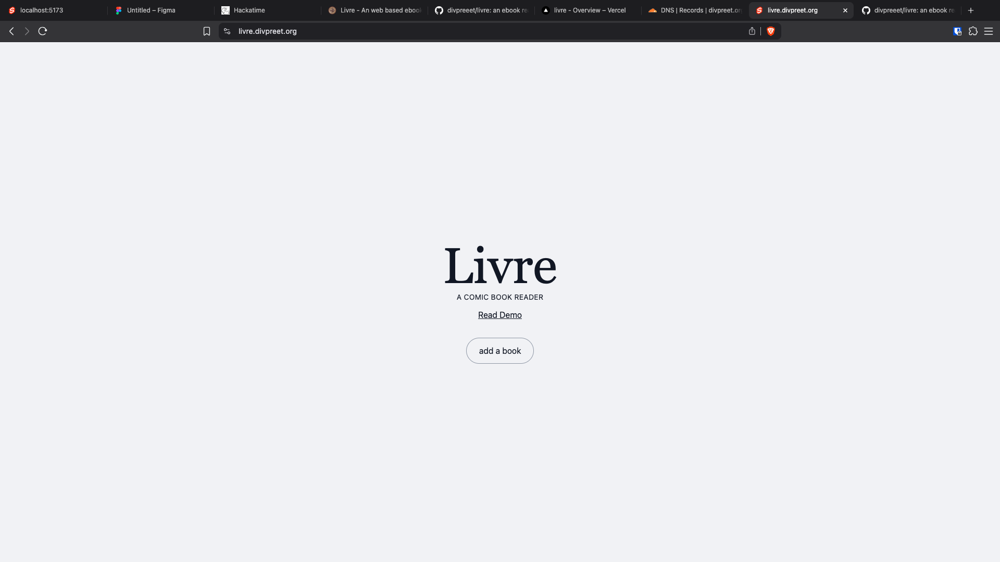
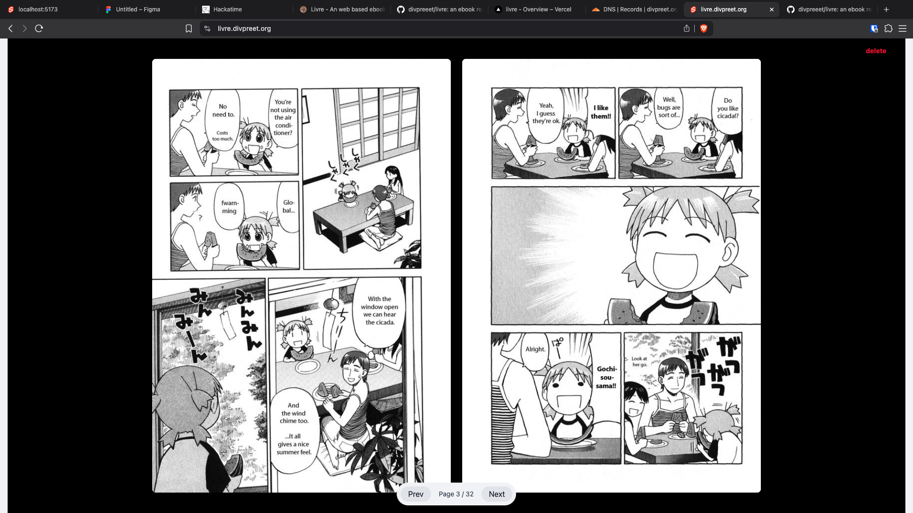

# livre
an comic book reader made for the web using svelte

## what is livre
livre means book in french

## how does this work
i tried to make this as simple to use as possible! you go to the site and then click add your comic, only **.cbz** files are supported, and then *ta-da*! your book opens up and you can read without issues!

currently localstorage is in a borked state and need somes fixing!

im still working on getting the website to be responsive!

## how to try it out?
### trying it out on online
simply go to [livre](https://livre.divpreet.org/) and add a .cbz book! or try the demo!

the reader has a pretty simple UI, next and prev buttons and a delete button!

### host it locally
simply clone the repo
```sh
git clone https://github.com/divpreeet/livre.git
cd livre
```

then run

```sh
npm install
npm run dev
```
then just head over to the localhost port in the terminal and you'd be good to go!

## project screenshots


